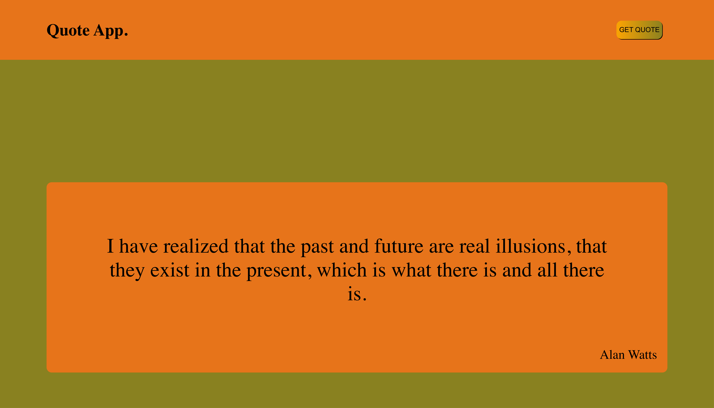
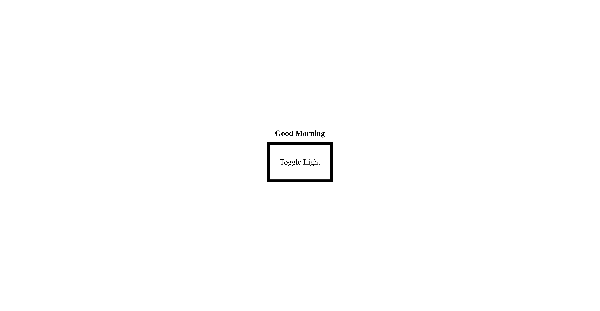
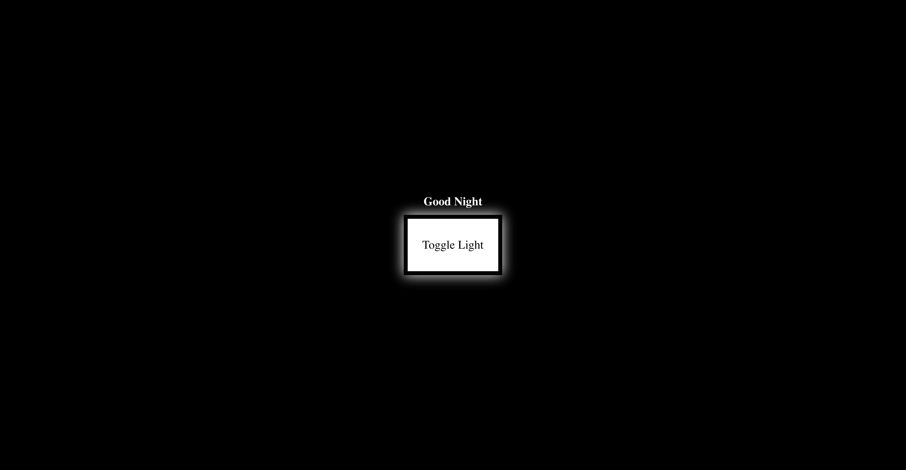
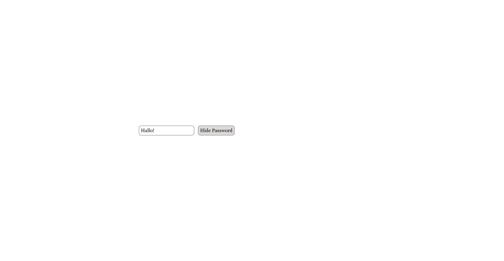

<!DOCTYPE html>
<html>

<body>

<h3>Collection of web application exercises with HTML, CSS and JavaScript</h3>

<table style="width:100%">
<tr>
     <td> <b>New Quotes </b> - use the fancy button to get random new quotes </td>
    <td></td>
    
  </tr>

  <tr>
     <td> <b>Light button </b> - switch from light to dark and back upon clicking </td>
    <td></td>
    <td></td>
  </tr>

   <tr>
    <td> <b>Password toggler </b> - switch between text and password type input </td>
    <td></td>
    <td></td>
  </tr>

 <tr>
    <td> <b>Check-boxen toggling </b> - ticking of boxes permitted under certain circumstances</td>
    <td></td>
    <td></td>
  </tr>

   <tr>
    <td> <b> Counter </b> - change of numbers and background gradient upon clicking</td>
    <td></td>
    <td></td>
  </tr>

  <tr>
    <td> <b> Color mixer </b> - change of range items leads to changing background</td>
    <td></td>
    <td></td>
  </tr>
  
</table>

</body>
</html>
